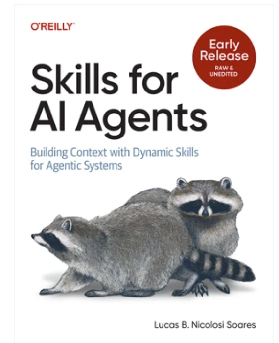
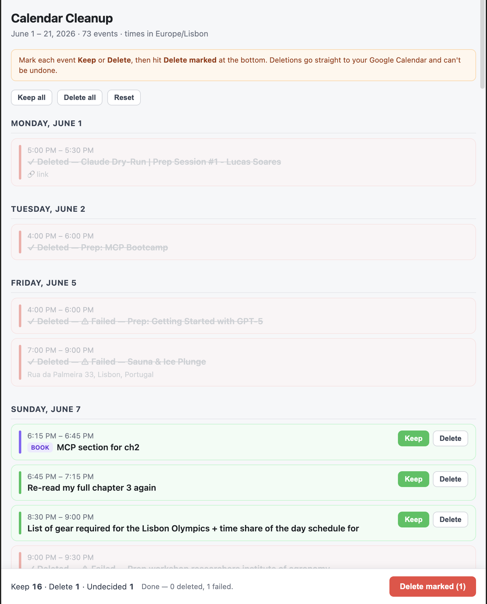
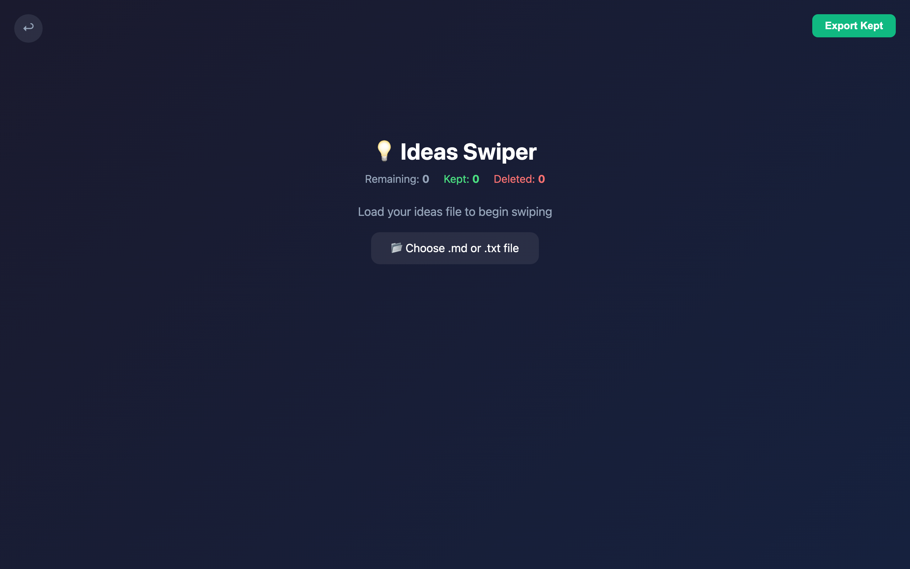
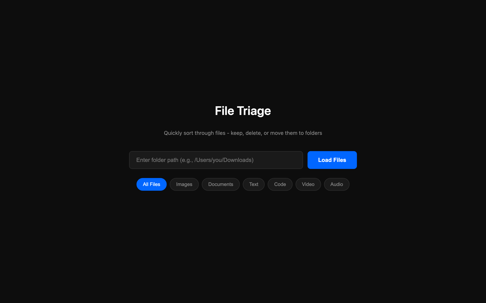
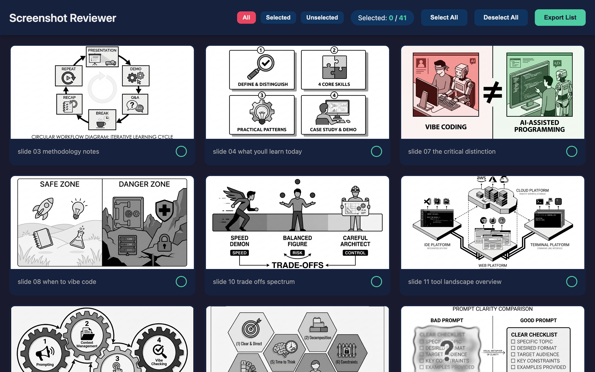
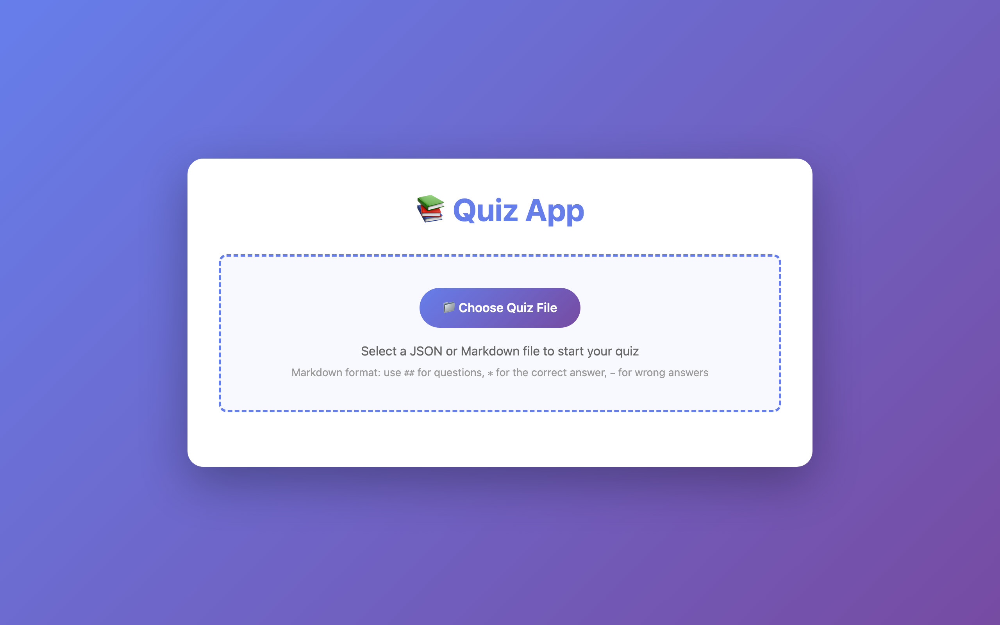
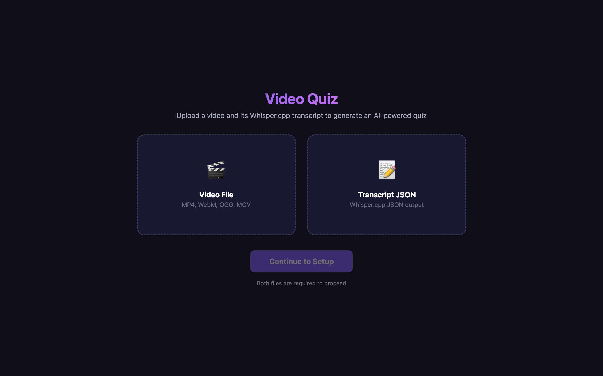
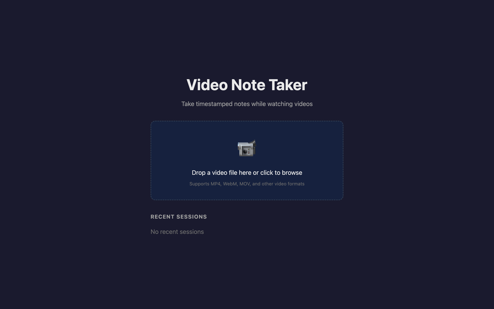
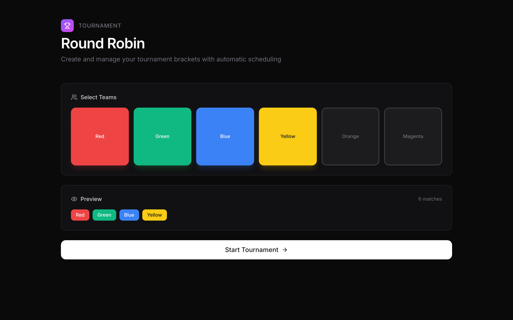
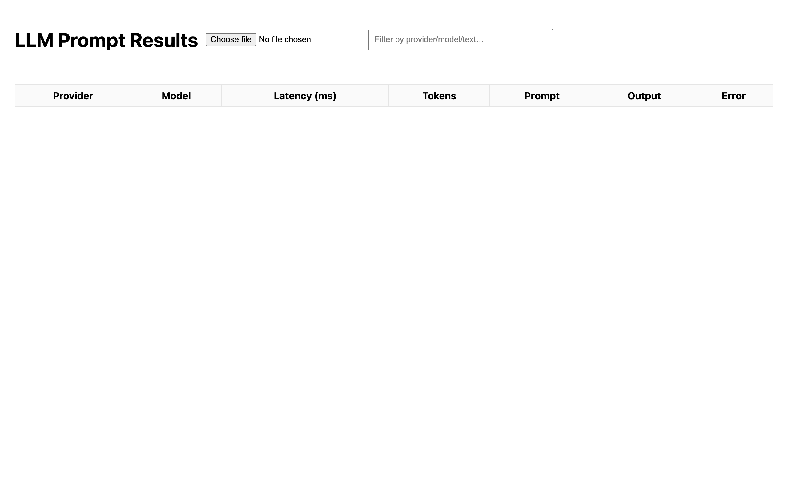

<!-- _class: lead dark -->
<!-- _paginate: false -->

O'Reilly Live Training

# Vibe Coding for Problem Solvers

## Solve your own problems with tiny apps

Lucas Soares · Automata Learning Lab

---

## About me

<i class="d1"></i><i class="d2"></i><i class="d3"></i>

AI Engineer &amp; Instructor.

I ship a throwaway little app almost every day — just to get my own work done faster.

Author · <em>Skills for AI Agents</em> (O'Reilly)
YouTube · @automatalearninglab

---

<!-- _class: lead -->

The whole course on one slide

# It's one loop.

01

A problem

Something annoying in my daily work

→

02

Vibe-code it

A tiny app, in minutes

→

03

A lesson

What worked? What didn't?

→

04

Trash · Reuse · Skillify

Keep it only if it earns it

Everything today is one turn of this loop — again and again.

---

<!-- _class: lead -->

What vibe coding actually is

Building software with an LLM, with little or no code review —

fine, because the stakes are small and the app is yours.

No spectrum charts. When it's your own small tool, speed beats ceremony.

Definition adapted from Simon Willison, 2025

---

<!-- _class: lead -->

Cold open · a real problem this week

73 events to triage on my calendar.

I did not want to click through the calendar app one by one.

So I made this in 5 minutes. →

<i class="d1"></i><i class="d2"></i><i class="d3"></i>

Mark Keep or Delete, hit the button — deletions go straight to Google Calendar. The decision <em>is</em> the workflow.

---

<!-- _class: lead dark -->

A quick tour

# Real problems → tiny apps

---

## Decision decks

Bulk small decisions you dread doing in the real app. Scrolling becomes deciding.

<i class="d1"></i><i class="d2"></i><i class="d3"></i>

<b>Idea swiper</b>Keep or kill ideas, fast

<i class="d1"></i><i class="d2"></i><i class="d3"></i>

<b>File triage</b>Sort a messy folder

<i class="d1"></i><i class="d2"></i><i class="d3"></i>

<b>Screenshot reviewer</b>Triage your screenshots folder

---

## Learn from your own stuff

Turn a document, article, or video into a way to test yourself.

<i class="d1"></i><i class="d2"></i><i class="d3"></i>

<b>Quiz app</b>Drop a doc → get quizzed

<i class="d1"></i><i class="d2"></i><i class="d3"></i>

<b>Video quiz</b>Video + transcript → quiz

---

## Keep it local

Some data should never leave your machine.

This note-taker plays your video locally and exports timestamped notes to a <code>.md</code> file. Nothing uploaded.

Video stays on deviceMarkdown export

<i class="d1"></i><i class="d2"></i><i class="d3"></i>

---

## Generators &amp; one-off dashboards

<i class="d1"></i><i class="d2"></i><i class="d3"></i>

<b>Round-robin tournament</b>A "fake Olympics" in an afternoon

<i class="d1"></i><i class="d2"></i><i class="d3"></i>

<b>Tiny dashboard</b>Whatever you're tracking this week

---

<!-- _class: lead dark -->

# The same loop made all of these.

Now let's slow down and learn the moves.

---

<!-- _class: lead dark -->

Part two

# The moves

---

Move 1 · Prompting

# Prompting is a workflow, not a checklist.

<h3>The old way</h3>

Memorize six generic "prompt patterns" and hope.

<h3>The real way</h3>

"I'm in Claude / Claude Code. I want to do <em>this</em>, then <em>this</em>. Here's how I actually talk to it."

---

Move 1 · the build, narrated by the prompts

# Building a decision deck, prompt by prompt

1 · clear first askBuild a single-file HTML app that loads a folder and shows one file at a time.

2 · iterate on what worksAdd left/right arrow keys to swipe, and a keep/delete counter at the top.

3 · decompose the hard partWire keep/delete to write a decisions.json I can run later.

4 · show, don't tellMatch the layout in this screenshot. Single file, no React.

---

Move 1 · two tools, one tiny problem

# Let each tool do what it's best at

Codex — autonomous task
Install playwright, scrape the full 3-day schedule from this URL, save it as JSON, open a PR.

Claude — iterative UI
Turn that schedule into a mobile-friendly page. Fetch from the URL, don't inline the JSON. Add a "download ICS" button.

One scrapes while you sleep. One builds while you watch. Same little problem.

Simon Willison — vibe-scraping Open Sauce 2025

---

<!-- _class: lead -->

Move 2 · Vibe checking

# Don't review every line. Check the things that bite.

For an app like this, here's what actually matters —

from dead simple to slightly technical.

---

Move 2 · the must-knows

# Security, simple → technical

<ul class="check" style="font-size:20px;margin-top:8px;line-height:1.6;">
<li><strong>Never</strong> put API keys anywhere that can go public.</li>
<li>Store keys in <strong>localStorage</strong> — they never touch a server. (Simon Willison's tip)</li>
<li>Keep sensitive data <strong>local</strong>. The video app? Video stays on the device.</li>
<li>Watch payload size: <strong>176 requests, 130&nbsp;MB</strong> is the kind of thing a vibe check catches.</li>
</ul>

---

Move 2 · how much checking is enough

# Enough vs. stop and think

<h3>A vibe check is enough</h3>
<ul>
<li>Personal &amp; local</li>
<li>Throwaway / one-off</li>
<li>Only you will use it</li>
</ul>

<h3>Stop and think</h3>
<ul>
<li>Anything public</li>
<li>Other people's data</li>
<li>Anything you'd hate to leak</li>
</ul>

---

Move 3 · Capability

# Which tool for which job

<h3 style="color:var(--accent)">Claude artifact</h3>
Instant single-file UI. Start here.

<h3 style="color:var(--accent)">Claude Code</h3>
Multi-file, your local files, MCP tools.

<h3 style="color:var(--accent)">Codex</h3>
Autonomous, walk-away tasks.

<h3 style="color:var(--accent)">v0 / Vercel</h3>
When it needs to be deployed.

Pick by the job, not the feature list.

---

Move 3 · models

# Leaderboards, made actionable

Unsure which model for a job? Check one board, take the top, move on.

<ul class="check" style="font-size:18px;margin-top:14px;">
<li><strong>LM Arena</strong> — general "which model feels smartest right now"</li>
<li><strong>Artificial Analysis</strong> — speed &amp; price per task</li>
</ul>

Models have training cut-offs → when in doubt, paste fresh docs into context.

---

<!-- _class: lead -->

Move 4 · the part that makes it a practice

# "What did I just learn?"

Trash it

Did its job. Let it go.

·

Reuse it

Keep it handy for next time

·

Skillify it

Promote to a reusable skill

---

# How small? Local or deployed?

<h3>Defaults that save you</h3>
<ul>
<li>As small as the problem — no smaller, no bigger</li>
<li>Default to <strong>local</strong> (a file you open)</li>
</ul>

<h3>Deploy only when…</h3>
<ul>
<li>Someone else needs to use it</li>
<li>Then: drop it on Vercel</li>
</ul>

---

<!-- _class: lead -->

Move 4 · the signal

# Rebuilt it three times? Make it a skill.

Repetition is the signal to promote a throwaway app into a reusable <strong>agent skill</strong> or command.

See: my book on Agent Skills

---

<!-- _class: lead dark -->

Part three

# Patterns you can use tomorrow

---

<!-- _class: lead -->

1

<h2>Start with a prototype, not a spec</h2>

Get something working in 5 minutes. Iterate on what's real, not on a doc.

---

<!-- _class: lead -->

2

<h2>Let it see what you see</h2>

Paste the full error. Screenshot the broken UI. Context beats description.

---

<!-- _class: lead -->

3

<h2>Restart when stuck</h2>

Going in circles for 10+ min? Fresh chat, a tiny handoff of state, continue clean.

---

<!-- _class: lead -->

4

<h2>Automate the repeatable step</h2>

Ask for one self-contained <code>uv</code> script. Paste, <code>uv run</code>, done.

# /// script 
# requires-python = "&gt;=3.12" 
# dependencies = ["requests"] 
# ///

---

<!-- _class: lead -->

5

<h2>Raw → structured</h2>

Messy notes in, clean JSON out. Notes → calendar, ideas → tasks.

---

<!-- _class: lead -->

6

<h2>The decision deck</h2>

Bulk small decisions → a swipe UI. The signature move of this whole course.

---

<!-- _class: lead -->

The meta-skill

# It works for thinking, too.

Swap "apps" for "ideas" and "prototypes" for "rough answers." Same loop — AI as an engine for quick, disposable thinking.

---

<!-- _class: lead dark -->

# The loop, once more

Problem

→

Tiny app

→

Lesson

→

Trash · Reuse · Skillify

Go make one this week.

---

<!-- _class: lead dark -->
<!-- _paginate: false -->

Connect with me

# Keep vibing, keep building

<a href="https://github.com/EnkrateiaLucca/vibe-coding-problem-solvers">Course materials — GitHub</a> 
<a href="https://www.linkedin.com/in/lucas-soares-969044167/">LinkedIn — Lucas Soares</a> 
<a href="https://x.com/LucasEnkrateia">X — @LucasEnkrateia</a> 
<a href="https://www.youtube.com/@automatalearninglab">YouTube — @automatalearninglab</a> 
lucasenkrateia@gmail.com

